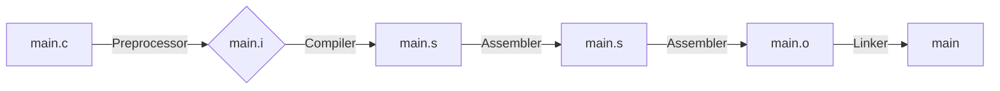

# Derleyici Seçenekleri ve Derleme Süreci

Bu dökümantasyon, GCC ve G++ derleyicilerinin temel kullanımını, VS Code ayarlarını ve C/C++ derleme sürecinin adımlarını açıklar.

---

## 🛠️ GCC (GNU Compiler Collection)

```bash
gcc -o main.o main.c -Wall -Wextra -Wconversion -Wsign-conversion
```

- **Wall:** Temel uyarıların tamamını aktif eder.
 
- **Wextra:** Daha fazla (detaylı) uyarı mesajı gösterir.
 
- **Wconversion:** Tür dönüşümleriyle ilgili uyarıları gösterir.
 
- **Wsign-conversion:** İşaretli (signed) ve işaretsiz (unsigned) türler arasındaki dönüşümlerde uyarı verir.

## 🧠 G++ (GNU C++ Compiler)

```bash
g++ -o main.o main.cpp -std=c++11 -I/source/includes
```

- **std=c++11:** Derleme sırasında C++11 standardı kullanılır.

- **I:** Başlık dosyalarının bulunduğu dizin belirtilir (include path).

## 💻 VS Code Derleyici Ayarları

```json title="tasks.json" linenums="1" hl_lines="2-4"
"-Wall",
"-Weffc++",
"-Wextra",
"-Wconversion",
"-Wsign-conversion",
"-Werror", // Tüm uyarılar hata olarak değerlendirilir.

"C_Cpp.default.cppStandard": "c++20" // C++20 standardı kullanılır.
```

## ⚙️ Derleme Süreci

Derleme süreci 4 temel adımdan oluşur:

