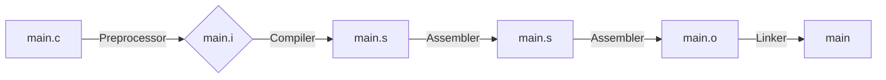

# Derleyici Seçenekleri ve Derleme Süreci

Bu dökümantasyon, GCC ve G++ derleyicilerinin temel kullanımını, VS Code ayarlarını ve C/C++ derleme sürecinin adımlarını açıklar.

---

## GCC (GNU Compiler Collection)

```bash
gcc -o main.o main.c -Wall -Wextra -Wconversion -Wsign-conversion
```

- **Wall:** Temel uyarıların tamamını aktif eder.
 
- **Wextra:** Daha fazla (detaylı) uyarı mesajı gösterir.
 
- **Wconversion:** Tür dönüşümleriyle ilgili uyarıları gösterir.
 
- **Wsign-conversion:** İşaretli (signed) ve işaretsiz (unsigned) türler arasındaki dönüşümlerde uyarı verir.

## G++ (GNU C++ Compiler)

```bash
g++ -o main.o main.cpp -std=c++11 -I/source/includes
```

- **std=c++11:** Derleme sırasında C++11 standardı kullanılır.

- **I:** Başlık dosyalarının bulunduğu dizin belirtilir (include path).

## VS Code Derleyici Ayarları

```json title="tasks.json" linenums="1" hl_lines="9-16"
{
  "version": "2.0.0",
  "tasks": [
    {
      "label": "C++ Build",
      "type": "shell",
      "command": "g++",
      "args": [
        "-std=c++20",
        "-Wall",
        "-Wextra",
        "-Wconversion",
        "-Wsign-conversion",
        "-Werror",
        "-o", "main",
        "main.cpp"
      ],
      "group": {
        "kind": "build",
        "isDefault": true
      }
    }
  ]
}
```

## Derleme Süreci

Derleme süreci 4 temel adımdan oluşur:



1️⃣ **Preprocessor (Ön İşlemci):** Yorum satırları kaldırılır, `#define` ve `#include` gibi direktifler işlenir.

```bash
gcc -E main.c -o main.i
```

2️⃣ **Compiler (Derleyici):** Kod, assembly diline çevrilir (donanıma daha yakın bir dil).

```bash
gcc -S main.i -o main.s
```

3️⃣ **Assembler (Çevirici):** Assembly kodu makine koduna dönüştürülür (binary).

```
gcc -c main.s -o main.o
```

4️⃣ **Linker (Bağlayıcı):** Object dosyalar birleştirilerek çalıştırılabilir program üretilir.

```
gcc main.o -o main
```

!!! note "Not"

    Tüm bu adımları tek komutla gerçekleştirmek ve ara dosyaları (.i, .s, .o) da görmek isterseniz:
    ```bash 
    gcc -save-temps main.c -o main
    ```
    Bu komut, derleme sırasında oluşturulan tüm geçici dosyaları da kaydeder.