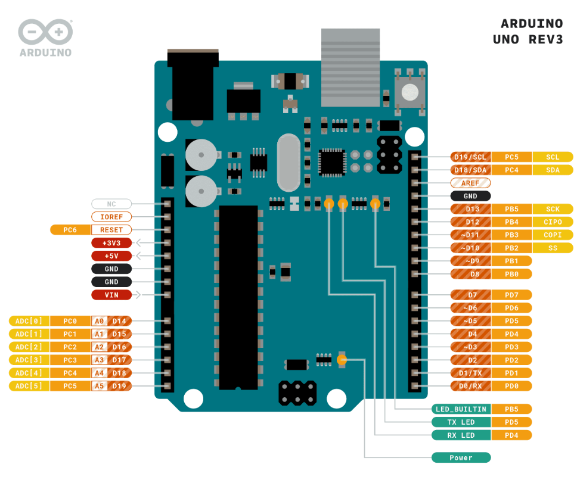
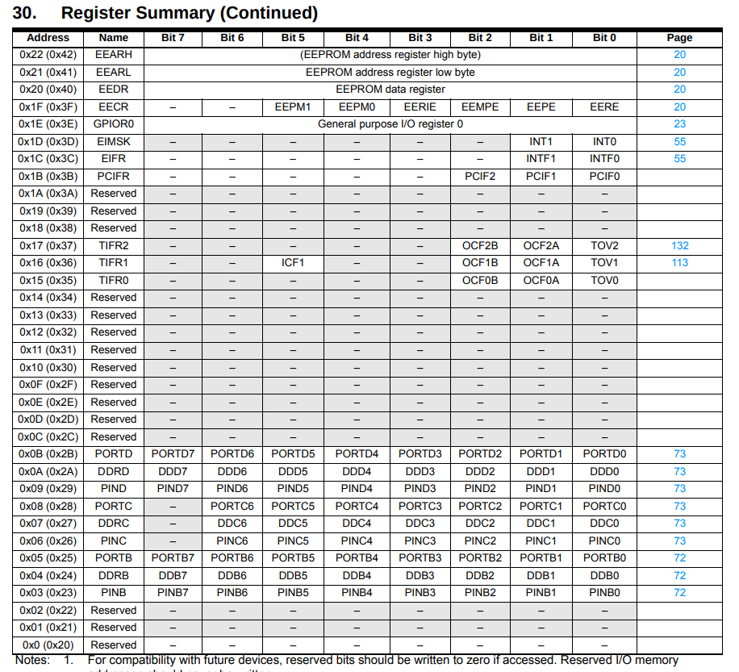

# AVR

### GPIO Nedir?
**GPIO (General Purpose Input/Output):** Mikrodenetleyicinin dijital giriş/çıkış pinlerini kontrol etmenizi sağlar. Bir pin’i **INPUT** (okuma) veya **OUTPUT** (yazma) modu olarak yapılandırabilirsiniz.

### Data Direction Register (DDRx)

- DDRx register’ı, ilgili port pinlerinin giriş (0) mi yoksa çıkış (1) mi olduğunu belirler.
- Örneğin AVR’de DDRB, DDRC, DDRD portları vardır.

```c
// PORTD’in 0. pini OUTPUT (çıkış) olarak ayarlanıyor:
DDRD = 0b00000001;   // aynı: DDRD = 0x01;

// Tüm pinleri OUTPUT yapmak için:
DDRD = 0xFF;         // 0b11111111
```

|                          HIGH NIBBLE |                             LOW NIBBLE |
| --- | --- |
|                      UPPER    NIBBER  |                           LOWER NIBBLE |
|                         0  0  0  0 |                           0  0  0  0 |
| MSB (Most Significant Bit) | LSB (Least Significant Bit) |

### Port Output Register (PORTx)
- `PORTx` register’ı, çıkış modundaki pinlere **HIGH (1)** veya **LOW (0)** çıkış seviyesini atar.
- `Binary` veya `hex` ile yazabilirsiniz:

```c
DDRD  = 0x01;        // D0 pinini OUTPUT yap
PORTD = 0x01;        // D0 pinini HIGH (5V)

// Tüm pinleri HIGH yapmak:
PORTD = 0xFF;        // 0b11111111

// Tüm pinleri LOW yapmak:
PORTD = 0x00;        // 0b00000000
```

### Bit Düzeyi İşlemler

| Operatör |	Açıklama |
|--------|-----------|
| `&`	| Bitwise AND (VE) |
| `	| ` |
| `^` | Bitwise XOR (ÖZEL VEYA) |
| `~` | Bitwise NOT (Tümüleyen) |
| `<<`	| Bitleri sola kaydırma (shift left) |
| `>>`	| Bitleri sağa kaydırma (shift right) |

- **Nibble:** 4 bit → 0000–1111 (hex’de 0–F)
- **MSB** (Most Significant Bit) en soldaki; LSB (Least Significant Bit) en sağdaki bittir.

### Tek Bir Pini Kontrol Etmek
- En temiz yöntem, bit kaydırma (1 << bit_no) ve mantıksal operatörler kullanmaktır:
- `|=` ve `&=` kullanımı, diğer pin değerlerini koruyarak yalnızca istediğiniz biti değiştirir.
```c
#include <stdint.h>

// D0 pinini HIGH yapmak (diğer pinler etkilenmez)
PORTD |= (1 << PORTD0);

// D0 pinini LOW yapmak
PORTD &= ~(1 << PORTD0);

// Aynı anda D0 ve D1 pinlerini HIGH yapmak
PORTD |= (1 << PORTD0) | (1 << PORTD1);
```

```c title="" linenums="1"
#include <avr/io.h>
#include <util/delay.h>
#include <stdint.h>

int main(void) {
    // Tüm PORTD pinlerini OUTPUT olarak ayarla
    DDRD = 0xFF;

    while (1) {
        // Sırayla LED’i yak
        for (uint8_t i = 0; i < 8; i++) {
            PORTD |= (1 << i);
            _delay_ms(100);
        }
        // Sırayla LED’i söndür
        for (uint8_t i = 0; i < 8; i++) {
            PORTD &= ~(1 << i);
            _delay_ms(100);
        }
        // Alternatif olarak XOR ile toggle:
        for (uint8_t i = 0; i < 8; i++) {
            PORTD ^= (1 << i);
            _delay_ms(100);
        }
    }
    return 0;
}
```

!!! note "Not"
    `int` gibi bilgisayarın sistemine göre değişen boyutların kullanımı bazı durumlarda değişik alanlar kapladığından sorun yartabilir bu yüzden her sistemde aynı bellek alanı genişliği tutan birimlerin kullanımı daha güvenlidir. `uint8_t` ,`uint16_t` ….

- `uint8_t` gibi sabit genişlikte tipler kullanmak, platform bağımsızlığı sağlar.
- **DDRD** ve **PORTD** bellek adresleri üzerinden doğrudan erişilen **I/O** register’larıdır. olarak **DDRD** bellek alanı `0x2A` bu kısıma erişip bu kısımda değişiklikler yapıp pinlerin durumları belirlenebilir.



```c
//Bu kısmın anlamı 0x2A bir adrestir ve bu adresin içinde bulunan verinin adı myDDRD dir.
#define myDDRD *((uint8_t*)0x2A) 
```

### PINx – Giriş Okuma Register’ı
- PINx register’ı, o porta bağlı pinlerin **giriş (INPUT)** durumunda okunan dijital seviyesini **(HIGH/LOW)** yansıtır.
- AVR’de: `PINB`, `PINC`, `PIND` gibi isimlerle kullanılır.
- **Pull‑Up ve Pull‑Down:** 
    - Arduino kartlarında dahili pull‑up dirençleri vardır; bu sayede unconnected (yüzer) pinler HIGH seviyede sabitlenir.
    - Eğer dahili pull‑up’u devre dışı bırakmak isterseniz, MCUCR’daki PUD bitini 1 yapabilirsiniz: `MCUCR |= (1 << PUD);  // Pull‑Up Disable`

```c title="Giriş seviyesini okumak" linenums="1"
// PINB’in 0. bitini oku
if (PINB & (1 << PORTB0)) {
    // Düğme basılı (HIGH)
} else {
    // Düğme serbest (LOW)
}
```

```c title="Debouncing (Titreşim Giderme)" linenums="1"
if (PINB & (1 << PORTB0)) {     // Butona basıldıysa
    _delay_ms(50);              // 50 ms bekle
    if (PINB & (1 << PORTB0)) { // Hala basılı mı?
        // Geçerli basış
    }
}
```

## ISR – Kesme Servis Rutinleri

- **SREG** içindeki I biti (`sei()`) set edilirse ve bir kesme kaynağı tetiklenirse, ilgili **ISR()** fonksiyonu çalışır.
- Kesmenin işlenebilmesi için:
    - **Global interrupt** (sei()) açık olmalı.
    - İlgili **Mask Register’da** (ör. **EIMSK**) o kesme kaynağı izinli olmalı.

```c title="Dış Kesme INT0" linenums="1"
#include <avr/io.h>
#include <avr/interrupt.h>

int main(void) {
    // 1. INT0 maskesini aç (EIMSK)
    EIMSK |= (1 << INT0);

    // 2. Kesme tetikleme konfigürasyonu (EICRA: düşük/rising seçimi)
    EICRA |= (1 << ISC01);  // ISC01=1, ISC00=0 → fall edge

    // 3. Global interrupt aç
    sei();

    while (1) {
        // Ana döngü
    }
}

// INT0 kesmesi gerçekleşince burası çalışır
ISR(INT0_vect) {
    // Kesme işleme kodu
}
```

| Register	| İşlevi |
|----------|---------|
| EIMSK	| External Interrupt Mask Register |
| EICRA	| External Interrupt Control Register A |
| EIFR	| External Interrupt Flag Register |
| MCUCR	| MCU Control Register (örn. PUD bit’i) |
| SREG	| Status Register (I biti = global interrupt) |

### Pin Change Interrupt (PCINT)
- **PCICR** register’ı ile belirli portlardaki pin değişim kesmelerini etkinleştirirsiniz.
- **PCMSKx** (Pin Change Mask) ile hangi pinlerin izleceğini seçersiniz.

### Timer/Counter:
- AVR mikrodenetleyicilerde üç temel timer vardır:

| Timer	 | Bit Genişliği |	Maks Sayaç Değeri |
|------|----|----|
| Timer0 | 8 bit	| 255 |
| Timer1 | 16 bit	| 65535 |
| Timer2 | 8 bit	| 255 |

- **CPU Frekansı ve Zaman Adımı:** 
    - Arduino Uno’da `F_CPU = 16 MHz → 1 döngü = 1 / 16 000 000 s ≈ 0.0625 μs`
    - Timer sayaç adımı = Prescaler’a bağlı olarak CPU döngü süresinin katları olur.

- **Basit Delay Hesabı:** 
    - **CTC (Clear Timer on Compare)** modunda, belirli bir gecikme için “compare match” değeri hesaplanır `OCRn = (DesiredDelay_s / TickTime_s) - 1`
    - TickTime_s = Prescaler × (1 / F_CPU)
    - Örnek: 10 ms gecikme, prescaler = 64:

```c linenums="1"
TickTime = 64 / 16 000 000 = 4 μs
OCRn = (0.010 s / 4e‑6) - 1 ≈ 2499
```

```c title="CTC Mode Örneği (Timer1)" linenums="1"
#include <avr/io.h>
#include <avr/interrupt.h>

void timer1_ctc_init(uint16_t ocr) {
    TCCR1B |= (1 << WGM12);         // CTC modu
    OCR1A = ocr;                    // Compare değeri
    TCCR1B |= (1 << CS11) | (1 << CS10); // Prescaler = 64
    TIMSK1 |= (1 << OCIE1A);        // Compare A kesmesini aç
    sei();                          // Global interrupt
}

ISR(TIMER1_COMPA_vect) {
    // 1 ms veya belirlediğiniz sürede burada çalışır
}

int main(void) {
    // Yaklaşık 1 ms için
    uint16_t ocr = (16e6/64/1000) - 1;  
    timer1_ctc_init(ocr);
    while (1) { }
}
```