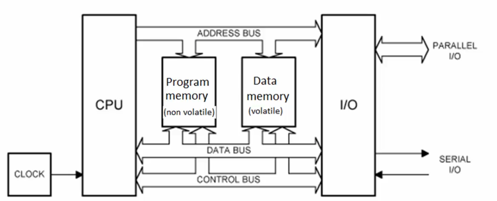
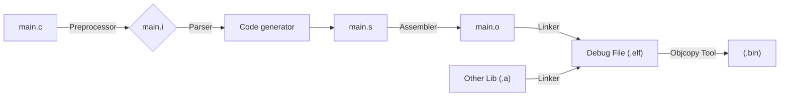

# Embedded Programming

### CPU (Central Processing Unit)
- Mikrodenetleyici veya bilgisayarın “beyni” konumundaki birimdir. Komutları alır, yorumlar ve yürütür.
- **ALU (Arithmetic Logic Unit):** Aritmetik (toplama, çıkarma, çarpma…) ve mantıksal (AND, OR, XOR…) işlemleri yapar.
- **CU (Control Unit):** Komutları sırayla okur, gerekli sinyalleri üretir ve diğer birimlerin senkronizasyonunu sağlar.
- **Register’lar:** 
    - Çok hızlı, küçük kapasiteli geçici depolama birimleri.
    - Örneğin: Program Counter (PC), Status Register (SR), Genel Amaçlı Register’lar (R0–R31).

### MPU (Microprocessor Unit)
- Sadece işlemci çekirdeği içerir.
- Harici RAM, ROM ve çevresel birim bağlantısına (GPIO, UART, SPI vb.) ihtiyaç duyar.
- PC’lere veya gömülü uygulamalarda “işlemci kartı” olarak kullanılır.

### MCU (Microcontroller Unit)
- Tek bir entegre çipte işlemci çekirdeği + bellek + çevre birimleri (GPIO, timer, ADC, UART, I²C, SPI vb.) barındıran tam donanımlı gömülü sistem bileşenidir.
- **Dahili Bellek:**
    - **Flash/ROM:** Program kodu depolama
    - **SRAM:** Veri ve stack alanı
- **Çevresel Birimler:** 
    - Dijital G/Ç (GPIO)
    - Analog‑dijital dönüştürücü (ADC)
    - Timers/Counter’lar
    - UART, SPI, I²C, CAN, USB vb. haberleşme modülleri
- Avantajları
    - Küçük ayak izi, düşük maliyet
    - Düşük güç tüketimi (batarya odaklı uygulamalar için ideal)
    - Tek kartta tüm bileşenler

| Özellik |	MPU | 	MCU |
|------|----------|-----------|
| İşlemci |	Var (yalnızca çekirdek) | 	Var (çekirdek + çevresel birimler) |
| Bellek	| Harici RAM/ROM |	Dahili Flash + SRAM |
| Çevresel Birimler |	Harici eklentilerle sağlanır |	Dahili UART, GPIO, ADC, timer vb. modüller |
| Kullanım Alanı	| PC, sunucu, yüksek performans	 | Gömülü sistem, IoT, otomotiv, endüstri |




## ITM (Instrumentation Trace Macrocell)
- ITM, ARM Cortex‑M tabanlı mikrodenetleyicilerde yerleşik olarak bulunan, **gerçek zamanlı izleme** ve **hata ayıklama** altyapısıdır:
- **Gerçek Zamanlı İzleme:** Kodunuzun akışını, fonksiyon çağrılarını veya değişken değerlerini canlı olarak “trace” edebilirsiniz.
- **Düşük Gecikme:** `SWO` (Serial Wire Output) pininden taşan veriyi, sistem performansını etkilemeden aktarır.
- **Performans Analizi:** Zaman damgalı etiketler (timestamps) sayesinde hangi kod bloğunun ne kadar sürdüğünü ölçebilir, darboğazları hızla tespit edebilirsiniz.
- **Özelleştirilebilir Paketler:** Hem ARM tarafından tanımlı standart trace paketlerini hem de kendi veri formatlarınızı kullanabilirsiniz.
- Kullanım Senaryoları
    - Zamanlama hatalarını keşfetme
    - Döngü sayımlarını ve iş parçacıkları arasındaki geçişleri izleme
    - Kalıcı log alınamayan gerçek zamanlı sistemlerde debug

### Cross Compiler (Çapraz Derleyici)
- Bir x86 veya macOS/Windows gibi “geliştirme host” makinenizde çalışıp, farklı bir “hedef” platform (ör. ARM Cortex‑M) için derlenmiş kod üreten derleyicidir. En yaygın örnek:

```
arm-none-eabi-gcc
│   │    │      └─ gcc (GNU Compiler Collection)
│   │    └─ eabi (Embedded Application Binary Interface)
│   └─ none (OS yok: bare‑metal)
└─ arm (ARM mimarisi)
```

- Çıktı Dosya Biçimleri
    - **ELF (.elf):** Çalıştırılabilir, simge tablosu ve debug bilgisi içerir. (Linux/Unix standardı)
    - **HEX (.hex):** Intel HEX formatı; her satırda adres + byte dizisi ASCII olarak saklanır. Mikrodenetleyici bootloader’larına uygundur.
    - **BIN (.bin):** Saf makine kodu; hiçbir meta‑veri içermez, doğrudan belleğe veya flash’a yazılır.
- **Tipik Derleme Akışı**
    - `arm-none-eabi-gcc -c main.c -o main.o` → Derleme
    - `arm-none-eabi-ld main.o -T linker_script.ld -o firmware.elf` → Bağlama
    - `arm-none-eabi-objcopy -O ihex firmware.elf firmware.hex` → HEX’e dönüştürme
    - `arm-none-eabi-objcopy -O binary firmware.elf firmware.bin` → BIN’e dönüştürme




## RCC (Reset and Clock Control)

**RCC**, mikrodenetleyicideki tüm modüllere saat (clock) sinyallerini sağlayan ve donanım-software sıfırlama (reset) işlemlerini yöneten merkezi bir birimdir.

- **Saat Kaynak Seçimi:** Dahili osilatör (HSI), harici kristal (HSE) veya PLL (Phase‑Locked Loop) kullanımı
- **Frekans Yapılandırma:** 
    - `AHB, APB1/APB2` gibi bus’lar için bölme (prescaler) değerlerini ayarlar
    - **PLL** parametreleriyle sistem saat hızını (SYSCLK) optimize eder
- **Güç Tüketimi:** Düşük güçlü modlar için clock gating (kullanılmayan modülleri durdurma)
- **Reset Yönetimi:** 
    - Sistem reset’i, güç reset’i, bağımsız watchdog reset’i gibi kaynakları kontrol eder
    - Her modülün reset bit’ini (örneğin `RCC_APB1RSTR`) yazarak o çevresel birimi yeniden başlatır

```c linenums="1"
// Örnek: HSI aktif et, SYSCLK olarak seç
RCC->CR |= RCC_CR_HSION;                  // HSI osilatörü aç
while (!(RCC->CR & RCC_CR_HSIRDY));       // OS hazır olana dek bekle
RCC->CFGR = (RCC->CFGR & ~RCC_CFGR_SW)     // SW alanını sıfırla
           | RCC_CFGR_SW_HSI;              // SYSCLK = HSI
```


## ISR (Interrupt Service Routine)

Bir kesme (**interrupt**) oluştuğunda otomatik olarak çağrılan kesme işleyici fonksiyonudur. Ana program akışı duraklar, ISR çalışır, sonra ana programa döner.

- **Giriş ve Çıkış:**
    - CPU **LR** (link register) içerisine dönüş adresini kaydeder
    - Kesme kaynağı bayrağını temizleyip (ör. `EXTI->PR |= …`) ilgili işlemi yapar

- **Kayıt Dağılımı:**
    - **R0–R12** → Genel amaçlı register’lar
    - **SP** (Stack Pointer) → Geçici veri ve ISR dönüş adresi
    - **LR** (Link Register) → ISR öncesi dönüş adresi
    - **PC** (Program Counter) → Bir sonraki yürütülecek komut

```c linenums="1"
void EXTI0_IRQHandler(void) {
    if (EXTI->PR & EXTI_PR_PR0) {
        EXTI->PR |= EXTI_PR_PR0;  // Kesme bitini temizle
        // … kesme işlemlerini gerçekleştir …
    }
}
```

## SVC (Supervisor Call)

Yazılım kesmesi (`svc`) aracılığıyla kullanıcı uygulamasından çekirdek veya RTOS hizmetlerine (ör. bellek ayırma, görev oluşturma) erişim sağlar.

```asm
SVC #5    ; SVC numarası 5 ile çekirdek çağrısı
```

```c
__ASM("svc 5");
```

## SWD (Serial Wire Debug)
ARM Cortex‑M serisinde kullanılan 2 telli (SWDIO, SWCLK) hata ayıklama protokolüdür:

- **Düşük pin sayısı** ile JTAG’a göre avantajlı
- Gerçek zamanlı bellek okuma/yazma, register izleme
- **SWO** (Serial Wire Output) ile trace mesajlarını aktarır

## JTAG (Joint Test Action Group)
Elektronik bileşenlerin test ve hata ayıklama standardıdır:

- 4 - 5 telli protokol (TCK, TMS, TDI, TDO, TRST)
- Boundary‑scan test, IC programlama, çekirdek debug
- SWD’ın alt kümesi olarak bazı ARM çekirdeklerinde desteklenir

|  | **JTAG** | **SWD** |
| --- | --- | --- |
| **Pin Sayısı** | 5-6 pin | 2 pin |
| **Temel Pinler** | TDI, TDO, TMS, TCK, TRST (opsiyonel) | SWDIO, SWCLK |
| **Zincirleme Desteği** | Var, birden fazla cihazı zincirleme olarak bağlayabilir | Yok, her cihaz için ayrı bağlantı gereklidir |
| **Hız ve Performans** | Daha fazla veri iletimi, daha yüksek hız, ancak karmaşık sistemlerde yavaş olabilir | Daha hızlı veri iletimi, düşük pin sayısı ile daha hızlı sonuç alabilirsiniz |
| **Karmaşıklık** | Daha karmaşık, çok sayıda pin ve yapılandırma gerektirir | Daha basit, düşük pin sayısı ve yapılandırma gerektirir |
| **Kullanım Alanları** | Daha büyük ve karmaşık sistemler, FPGA'lar, bellekler, CPU'lar | ARM Cortex-M mikrodenetleyiciler, düşük pinli yapılar |
| **Debugging Yeteneği** | Kapsamlı debugging, register işlemleri ve sistem izleme | Temel debugging, register okuma/yazma, programlama |
| **Zamanlayıcı Desteği** | Yüksek hızda test ve iletişim gerektiren sistemler için uygundur | Düşük pin sayısı ile hızlı hata ayıklama sağlar |
| **Enerji Tüketimi** | Daha fazla enerji tüketebilir, daha fazla pin kullanıldığı için | Daha az enerji tüketir, çünkü sadece 2 pin kullanılır |
| **Karmaşık Sistemler İçin Uygunluk** | Yüksek hızda ve karmaşık sistemlerde kullanılır | Daha basit ve düşük pin sayısına sahip sistemler için uygundur |


## AHB (Advanced High‑performance Bus)
**AHB**, ARM AMBA (Advanced Microcontroller Bus Architecture) ailesinin yüksek hızlı veri yolu katmanıdır. Özellikleri:

- **Yüksek Bant Genişliği:** Burst transfer desteği sayesinde ardışık veri bloklarını kesintisiz taşır.
- **Düşük Gecikme:** Pipeline mimarisiyle her döngüde bir transfer başlatılabilir.
- **Multi‑Master Desteği:** Birden fazla bus master (ör. DMA, CPU) arasında arbitraj yaparak kontrolü paylaşır.
- **Genel Kullanım:** 
    - **Ana işlemci (CPU)** ve **DMA** birimi doğrudan AHB’ye bağlıdır.
    - **Sistem bellekleri** (SRAM/Flash) ve sabit bellek arayüzleri genellikle AHB üzerinden erişilir.

```c
// Örnek (STM32): AHB1 üzerindeki GPIOA saatini etkinleştirme
RCC->AHB1ENR |= RCC_AHB1ENR_GPIOAEN;
```

## APB (Advanced Peripheral Bus)
APB, AMBA ailesinin düşük hızlı çevre birimleri için tasarlanmış basitleştirilmiş veri yoludur:

- **Düşük Karmaşıklık:** Tek döngülü, pipelineless tasarım; aracılar (bridges) üzerinden AHB’ye bağlanır.
- **Düşük Güç Tüketimi:** Çevresel birimleri gerektikçe uyandıracak şekilde çalışır.
- **Tipik Kullanım:** UART, SPI, I²C, Timer’lar gibi düşük hızlı algılayıcı ve kontrol modülleri APB üzerinde yer alır.

```c
// Örnek (STM32): APB1 üzerindeki TIM2 saatini etkinleştirme
RCC->APB1ENR |= RCC_APB1ENR_TIM2EN;
```


| Özelikler | **AHP** | **APB** |
| --- | --- | --- |
| Hız | Yüksek hızda veri iletimi | Düşük hızda veri iletimi |
| Veri Transferi | Burst transfer, pipelining, yüksek hız | Tek veri transferi, basit iletişim |
| Yapı | Karmaşık, daha fazla donanım gereksinimi | Basit, düşük maliyetli |
| Gecikme | Düşük gecikme | Yüksek gecikme |
| Uygulama Alanları |  CPU, DMA, bellek arayüzleri, büyük veri transferi | Çevre birimleri (UART, I2C, GPIO, Timer vb.) ile iletişim |
| Bağlantı Tipi | Master/slave yapısı, daha karmaşık bağlantılar | Basit veri iletimi ve bağlantılar
| Güç Tüketimi | Yüksek güç tüketimi | Düşük güç tüketimi |


## Burst Transfer
Burst Transfer, yüksek hızlı veri yollarında ardışık ve blok halinde veri iletimi sağlayan yöntemdir:

- **Blok İletimi:** Birçok küçük hatta tek tek veri yerine, büyük bir veri bloğu peş peşe aktarılır.
- **Verimlilik:** Her küçük veri paketi için ayrı başlatma/durdurma/idare işlemi yapılmaz; başlatma/durdurma maliyeti tek seferde ödenir.
- **Düşük Gecikme:** Pipeline desteğiyle, her clock döngüsünde yeni bir veri kelimesi transfer edilebilir.
- **Yüksek Bant Genişliği:** Burst modunda, topyekûn aktarım hızında ciddi artış sağlar.

## Access Level (Erişim Seviyesi)
Gömülü sistemlerde erişim seviyeleri, kodun hangi modda çalıştığını ve hangi kaynaklara erişebileceğini belirler

| Mod	| Açıklama |
|----|----|
| Handler Mode	| Kesme ve istisna işleyicilerinin (ISR) çalıştığı, her zaman ayrıcalıklı modu. |
| Thread/User Mode |	Normal uygulama kodunun çalıştığı mod; ister ayrıcalıklı, ister kısıtlı olabilir. |
| PAL (Privileged Access) |	Tüm sistem kaynaklarına tam erişime izin verir (örn. donanım kontrolü). |
| NPAL (Non‑Privileged) |	Korunan belleğe ve kritik birimlere erişimi sınırlandırır. |


## Heap Memory (Yığın Dışı Bellek)
- **Dinamik Tahsis:** malloc, calloc, new gibi fonksiyonlarla çalışma zamanında ayrılır.
- **Yaşam Süresi:** Serbest bırakılana (free, delete) dek bellekte kalır.
- **Kullanım Alanı:** Büyüklüğü önceden bilinmeyen diziler, veri yapıları (linked list, tree vb.).

## Stack Memory (Yığın Belleği)
- **Otomatik Yönetim:** Fonksiyon çağrısı sırasında push, dönüşte pop edilir.
- **Yerel Değişkenler:** Her çağrıda yeni bir çerçeve (stack frame) oluşturulur.
- **Sınır:** Sabit boyutludur; taşma (stack overflow) riski vardır.

## AAPCS (ARM Architecture Procedure Call Standard)
- ARM mimarisinde fonksiyon çağrı sözleşmesini tanımlar. Amaçlar:
    - **Parametre İletimi:** İlk dört parametre `r0–r3` register’larında, fazlası yığında (stack) taşınır.
    - **Geri Dönüş Adresi:** `lr` (link register) içinde saklanır.
    - **Yığın Düzeni:** Yeni çerçevede önce geri dönüş adresi, sonra yerel register kurtarma alanı, en altta yerel değişkenler yer alır.
    - **Kayıt Koru:** Callee‑saved (`r4–r11`) ve Caller‑saved (`r0–r3, r12, lr`) register’lar ayrıştırılır.
- Bu standart, farklı derleyiciler ve kütüphaneler arasında uyum ve taşınabilirlik sağlar.

## NVIC (Nested Vectored Interrupt Controller)
ARM Cortex‑M mikrodenetleyicilerinde kesme yönetimini üstlenen donanım modülüdür:

- **Vectored Interrupts:** Her kesme kaynağı için önceden tanımlı vektör tablosu (ISR adresleri).
- **Öncelik Seviyeleri:** 0 (en yüksek) → 255 (en düşük) arası öncelik atayarak, kritik kesmelere öncelik verebilirsiniz.
- **Nesting (İç İçe Kesme):** Daha yüksek öncelikli kesme, daha düşük öncelikli bir ISR çalışırken bile tetiklenip işlenebilir.
- **Enable/Disable:** İstediğiniz kesmeyi `NVIC_EnableIRQ(IRQn)` ve `NVIC_DisableIRQ(IRQn)` ile kontrol edebilirsiniz.

```c
// EXTI0 kesmesini öncelik 2 olarak ayarlayıp etkinleştirme (STM32 HAL)
HAL_NVIC_SetPriority(EXTI0_IRQn, 2, 0);
HAL_NVIC_EnableIRQ(EXTI0_IRQn);
```

## MSP ve PSP (Stack Pointer’lar)
ARM Cortex‑M işlemcide iki ayrı stack kullanılır:

| İşaretçi	| Kullanım Alanı	| Mod |
| MSP	| Kesme servis rutinleri ve sistem başlatma |	Privileged (kernel) |
| PSP	| Uygulama kodu ve thread işlemleri	| Thread (user) |

- **MSP (Main Stack Pointer):** Sistem başlangıcında yığını MSP yönetir.
- **PSP (Process Stack Pointer):** OS/RTOS kullanıldığında, her thread kendi PSP yığınına sahip olabilir.

```c
// PSP kullanımı örneği (CMSIS)
__set_PSP(0x20002000);       // PSP başlangıç adresini ayarla
__set_CONTROL(__get_CONTROL() | 2); // CONTROL register’da SPSEL bit’i = 1 (PSP seç)
```

## T‑Bit (Thumb Bit)
- ARM işlemciler, iki komut seti arasında geçiş yapabilir:
- **ARM Modu:** 32‑bit uzunluğunda komutlar; `T‑bit = 0`.
- **Thumb Modu:** 16‑bit uzunluğunda sıkıştırılmış komutlar; `T‑bit = 1`.
    - Daha küçük kod boyutu, düşük bellek tüketimi.
    - Genellikle Cortex‑M çekirdekleri sadece Thumb modu destekler.


## Bit‑Banding
- Bit‑Banding, belirli bellek bölgesindeki her biti ayrı bir adrese eşler. Böylece tek adımla tek bir biti set/clear edebilirsiniz:
- Memory Region: 0x20000000–0x200FFFFF
- Alias Region: 0x22000000–0x23FFFFFF
- Hesaplama Formülü: `alias_addr = alias_base + (byte_offset × 32) + (bit_number × 4)`

```c
// Örneğin 0x20000000 adresindeki 3. bit için alias:
alias = 0x22000000 + (0 × 32) + (3 × 4) = 0x2200000C

// Bit‑banding ile GPIOA pin0’u HIGH yapma (STM32)
#define BITBAND_SRAM(addr, bit) \
  (*(volatile uint32_t*)(0x22000000 + (((addr) - 0x20000000) << 5) + ((bit) << 2)))

#define GPIOA_ODR_ADDR  (0x40020000 + 0x14)  // GPIOA ODR offset
BITBAND_SRAM(GPIOA_ODR_ADDR, 0) = 1;       // PA0 HIGH
```

| Register |	Açıklama |
|-----|---------------|
| ODR	| Output Data Register (çıkış verisi) |
| IDR	| Input Data Register (giriş verisi) |
| BSRR	| Bit Set/Reset Register (set ve reset için) |
| BRR	| Bit Reset Register (sadece reset için) |


## HSI (High‑Speed Internal Oscillator)
- **Dahili osilatör:** MCU içinde entegre edilmiştir.
- **Frekans:** STM32 modellerine göre genellikle 8 MHz veya 16 MHz.
- **Avantaj:** Harici kristal gerekmez, hızlı başlar ve düşük güç tüketir.
- **Dezavantaj:** Doğruluğu `±1 %` civarında; hassas zamanlama gerektiren protokoller için ideal değil.

## HSE (High‑Speed External Oscillator)
- Harici kristal veya dış saat sinyali kullanır.
- **Desteklenen frekans:** 4 MHz – 25 MHz
- **Avantaj:** Çok daha kararlı ve doğru saat kaynağı.
- **Kullanım:** USB, CAN, SDIO, yüksek hızlı UART gibi hassas zamanlama gerektiren iletişimler.

## Programlama Notları
- Reference Manual: MCU’nun tüm modülleri, register haritaları ve işleyişi hakkında ayrıntılı doküman.
- Datasheet:
    - Alternate Function Mapping: Pinlerin hangi alternatif işlevleri desteklediğini gösterir.
    - Block Diagram: MCU içindeki birimlerin birbirine fiziksel bağlantılarını görsel olarak sunar.

- **Kod Optimizasyonu (STM32CubeIDE):**
    - `Project > C/C++ Build > Optimization Level` ile derleyici optimizasyon seviyesini belirler.
    - Yüksek optimizasyon kod boyutunu azaltır, ancak bazen kritik kod parçalarını kaldırabilir.

- **Otomatik Tamamlama:** STM32CubeIDE içinde `Ctrl+Space`

### volatile Anahtar Kelimesi
- Derleyicinin optimizasyonu devre dışı bırakır:
- Belleğe veya donanım register’larına yazılan değişkenlerin her erişimde gerçekten okunmasını sağlar.
- **Kesme (ISR)** veya **donanım etkileşimleri** sonucu değişebilecek veriler için zorunludur.

```c
volatile uint32_t timer_ticks;
```

### Struct Hizalaması ve Padding
- C’de struct’lar, içindeki en büyük veri tipinin hizalanma gereksinimine göre “padding” ekler.
- Bellek düzenini sıkı kontrol için:

```c
#pragma pack(push, 1)
typedef struct {
    char a;   // 1 byte
    int  b;   // 4 byte
} PackedStruct;
#pragma pack(pop)


typedef struct __attribute__((packed)) {
    char a;
    int  b;
} PackedStruct;
```

## ARM GCC Inline Assembly

C/C++ kodu içinde doğrudan **ARM assembly** komutları yazmanızı sağlar. Özel donanım komutları veya performans kritik işlemlerde kullanışlıdır.

```c
int add_numbers(int a, int b) {
    int result;
    __asm__ (
        "ADD %0, %1, %2\n\t"   // ARM ADD komutu
        : "=r" (result)        // çıktı operandı
        : "r" (a), "r" (b)     // giriş operandları
        :                      // tahrip edilen register’lar
    );
    return result;
}
```

!!! note "Not"
    Daha fazla bilgi için **“Cortex‑M4 Devices Generic User Guide”** içindeki **“The Cortex‑M4 Instruction Set”** bölümüne bakın.


## GPIO Başlatma ve Kullanımı
- Clock Aktifleştirme İlgili GPIO portunun saatini açın: `RCC->AHB1ENR |= RCC_AHB1ENR_GPIOAEN;`
- Pin Modu ve Özellikleri GPIOx->MODER, OTYPER, OSPEEDR, PUPDR register’larını kullanarak:

```c
// PA5’i push‑pull çıkış, yüksek hız, no pull‑up/down olarak ayarlama
GPIOA->MODER   &= ~(3 << (5*2));
GPIOA->MODER   |=  (1 << (5*2));       // 01 = output
GPIOA->OTYPER  &= ~(1 << 5);           // 0 = push‑pull
GPIOA->OSPEEDR |=  (3 << (5*2));       // 11 = high speed
GPIOA->PUPDR   &= ~(3 << (5*2));       // 00 = no pull‑up/down
```

- Çıkış ve Giriş İşlemleri

```c title="output" linenums="1"
GPIOA->ODR |=  (1 << 5);  // PA5 = HIGH
GPIOA->ODR &= ~(1 << 5);  // PA5 = LOW
```

```c title="Input" linenums="1"
uint8_t state = (GPIOA->IDR & (1 << 5)) ? 1 : 0;
```

## Bilgisayarda printf ile Debug (ITM Kullanarak)
- `syscalls.c` içinde `_write` fonksiyonunu **ITM**’e yönlendirin

```c
#define DEMCR           (*((volatile uint32_t*)0xE000EDFC))
#define ITM_STIMULUS0   (*((volatile uint32_t*)0xE0000000))
#define ITM_TCR         (*((volatile uint32_t*)0xE0000E00))

void ITM_SendChar(uint8_t ch) {
    DEMCR |= (1 << 24);        // TRCENA bit’i
    ITM_TCR |= 1;              // Port 0 aktif
    while ((ITM_STIMULUS0 & 1) == 0);
    ITM_STIMULUS0 = ch;
}

int _write(int file, char *ptr, int len) {
    for (int i = 0; i < len; i++) {
        ITM_SendChar((uint8_t)ptr[i]);
    }
    return len;
}
```

### Debug Konfigürasyonu
- Debug Configurations → ST‑Link GDB Server
- Interface: **SWD**
- SN: (Cihaz Seri Numarası)
- **Serial Wire Viewer (SWV):** Enable

### SWV ITM Konsolunu Açın
- **Window → Show View → SWV → SWV** ITM Data Console
- **Configure Trace:** Port 0 seçin → Start Trace
- Artık `printf("Hello %d\n", x);` çağrıları SWV konsolda görünecektir.


## STM32CubeIDE Kısayolları
- `Ctrl + O`    : Açık dosyada fonksiyon ve sembolleri listeler
- `Ctrl + Space` : Kod tamamlama (auto‑complete)
