# AI

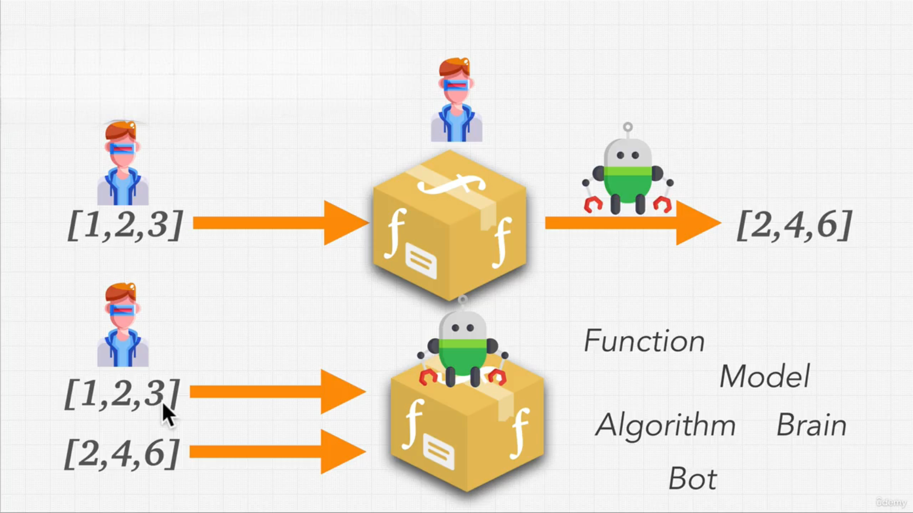

Kullanıcılar modele girdi verilerini sağlar; geliştiriciler ise uygun işlem adımlarını (“fonksiyonu”) tanımlar. Yapay zekâ, bu fonksiyonun en iyi hâle getirilmesi yani veri ile beklenen sonuç arasındaki bağıntının algoritma tarafından “öğrenilmesi” işini üstlenir. Kısacası, yapay zekâ elinizdeki örnek girdi‑çıktı çiftlerinden hareketle, işinizi “otomatik olarak” yapacak fonksiyonu bulur ve genelleştirir.

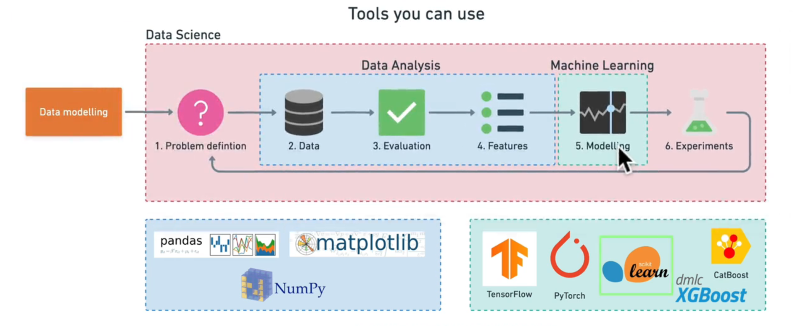

## Denetimli Öğrenme (Supervised Learning) 
- **Tanım:** Girdi / çıktı eşleştirmeleri içeren etiketli verilerle eğitim yapılır.
- **Amaç:** Modelin, bilinmeyen girdilere doğru çıktılar tahmin etmesini sağlamak.
- **Nasıl Çalışır?**
    - Eğitim seti: `(x₁, y₁), (x₂, y₂), …` gibi girdi–etiket çiftleri.
    - Model, x’ten y’yi öğrenmeye çalışır (örn. doğrusal regresyon, karar ağaçları, sinir ağları).
- **Uygulama Örnekleri:**
    - **E‑posta sınıflandırma:** “spam” vs. “spam değil”
    - **Görüntü tanıma:** Fotoğraftaki nesnenin etiketi
    - **Finans:** Kredi risk tahmini

## Denetimsiz Öğrenme (Unsupervised Learning)
- **Tanım:** Etiketlenmemiş verilerdeki gizli yapıları keşfeder.
- **Amaç:** Veri kümelerini anlamak, gruplamak veya indirgemek.
- **Nasıl Çalışır?**
    - **Kümelendirme (clustering):** Benzer verileri bir araya toplar (K‑means, DBSCAN).
    - **Boyut indirgeme (dimensionality reduction):** Özellik sayısını azaltır (PCA, t-SNE).

- Uygulama Örnekleri:
    - **Müşteri segmentasyonu:** Benzer alışveriş kalıplarına göre gruplama
    - **Anomali tespiti:** Verideki uç noktaları bulma
    - **Öznitelik çıkarımı:** Verinin temel bileşenlerini keşfetme

## Pekiştirmeli Öğrenme (Reinforcement Learning)
- **Tanım:** Bir ajan, bir ortam içinde adım adım eylemler seçerek ödül toplar ve stratejisini geliştirir.
- **Amaç:** Uzun vadeli toplam ödülü maksimize eden bir politika öğrenmek.
- **Nasıl Çalışır?**
    - Ajan, ortamın bir durumuna (s) bakar.
    - Bir eylem (a) seçer.
    - Ortam yeni duruma (s') geçer ve bir ödül (r) verir.
    - Ajan, (s, a, r, s') tecrübesinden öğrenir.
    - Algoritmalar: Q‑Learning, SARSA, Deep Q‑Networks (DQN), Policy Gradient yöntemleri (REINFORCE, PPO).
- **Uygulama Örnekleri:**
    - **Otonom sürüş:** Aracı güvenli ve verimli sürüşe yönlendirme
    - **Oyun oynama:** Atari, Go, satranç gibi oyunlarda insan‑üstü performans
    - **Robot kontrolü:** Manipülatör kol hareketlerini optimize etme

## Hata Bulma Adımları

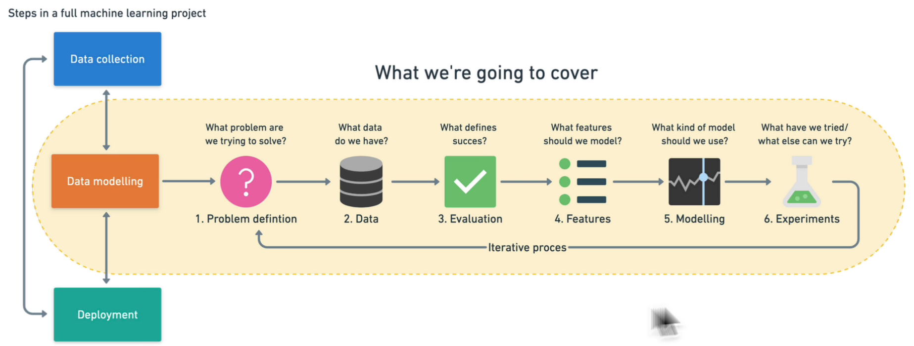

1. **Problem Definition:** What problem are we trying to solve?
2. **Data:** What kind of data do we have?
3. **Evaluation:** What defines success for us?
4. **Features:** What do we already know about the data?
5. **Modelling:** Based on our problem and data, what model should we use? 
6. **Experimentation:** How could we improve/what can we try next?


## Cross‑Validation
- Cross‑Validation, makine öğrenimi modellerinin genelleme yeteneğini (overfitting’i önleyerek gerçek dünyada nasıl performans göstereceğini) değerlendirmek için yaygın olarak kullanılan bir tekniktir. Temel adımlar şöyle işler: 
    - **Veri Kümesini Parçalara Bölme**
        - En yaygın yöntem **k‑fold** cross‑validation’dır: Veri seti eşit büyüklükte k parçaya (fold) bölünür.
        - Örneğin `k = 5` ise, veri beş parçaya ayrılır.
    - **Eğitim ve Test Döngüleri**
        - Her seferinde bu k parçadan biri test seti, kalan `k – 1` parça eğitim seti olarak kullanılır.
        - Toplam k farklı model eğitilir ve test edilir.
    - **Performans Ölçümü**
        - Her döngü için hata veya skor metriği (örn. doğruluk, MSE, R²) hesaplanır.
        - Tüm k sonuç ortalanarak nihai performans tahmini elde edilir.
    - **Avantajları**
        - Veri setindeki rastgele bölünmelere bağlı sapmayı azaltır.
        - Modelin farklı alt kümelerde nasıl davrandığına dair kapsamlı bilgi sunar.
        - Özellikle küçük veri setlerinde daha güvenilir bir değerlendirme sağlar.

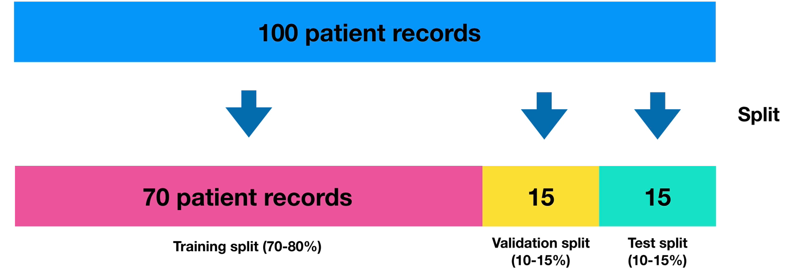


Yaygın Cross‑Validation Yöntemleri
| Yöntem	 | Açıklama |
|----------|-----------|
| k‑Fold	| Veri k parçaya bölünür ve k kez eğitim/test yapılır. |
| Stratified k‑Fold |	Özellikle sınıflandırmada, her fold’da sınıf oranlarını korur. |
| Leave-One-Out |	k = N (her örnek bir fold); her model tek bir örnek test eder. |
| Shuffle Split	 | Rastgele bölme ve tekrarlama; her döngüde farklı rastgele bölme. |

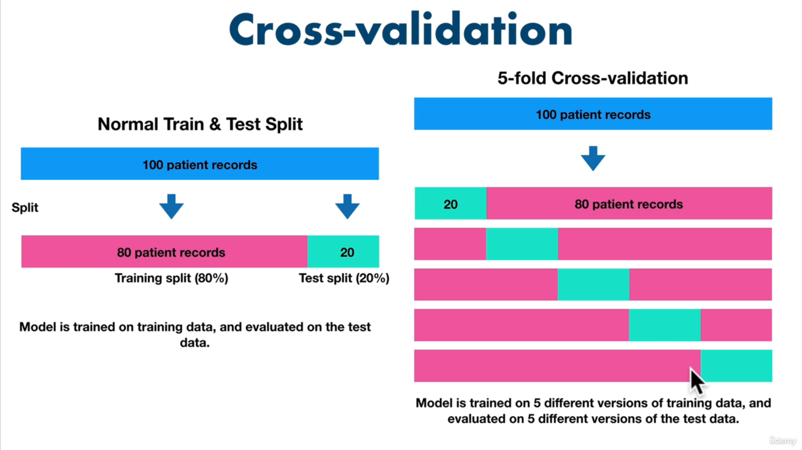

### Neden Kullanılır?
- **Genelleme Hatalarını Ölçer:** Tek seferlik eğitim/test bölünmesine kıyasla daha istikrarlı metrikler sağlar.
- **Model Seçimi:** Farklı hiperparametrelerin karşılaştırılmasında güvenilir sonuç verir.
- **Küçük Veri Setleri:** Sınırlı veri olduğunda, her örnek hem eğitim hem test için kullanılarak veri verimli değerlendirilir.

!!! note "Not"
    Bu yöntemle, modelinizin Coefficient of Determination (`R²`), doğruluk veya diğer metriklere dayalı performans tahmininiz daha güvenilir ve tekrarlanabilir hale gelir.

## Pandas
Pandas, Python’da veri analizi ve manipülasyonu için kullanılan bir kütüphanedir. Genellikle veri işleme, temizleme, dönüştürme ve analiz gibi veri bilimi ve veri analitiği projelerinde tercih edilir.

## NumPy
- NumPy, Python programlama dilinde bilimsel hesaplama ve çok boyutlu dizi işleme için kullanılan güçlü bir kütüphanedir.
- `ndarray` yapısı ile çok boyutlu diziler oluşturur.
- Diziler üzerinde hızlı matematiksel operasyonlar (aritmetik, istatistik, lineer cebir vb.) sunar. Bu özellikleri sayesinde NumPy, veri analizi, makine öğrenimi ve görüntü işleme başta olmak üzere pek çok alanda yaygın olarak kullanılır.

## Matplotlib
- Matplotlib, Python’da grafik ve görselleştirme oluşturmak için kullanılan kapsamlı bir kütüphanedir. Bilimsel topluluklar ve veri bilimcileri tarafından sıkça tercih edilir.
- **Çizgi grafikleri** (`plot`)
- **Saçılım grafikleri** (`scatter`)
- **Çubuk grafikleri** (`bar`)
- **Histogramlar** (`hist`)
- **3D grafikler** (`mpl_toolkits.mplot3d`) ve daha pek çok grafik türünü destekler.

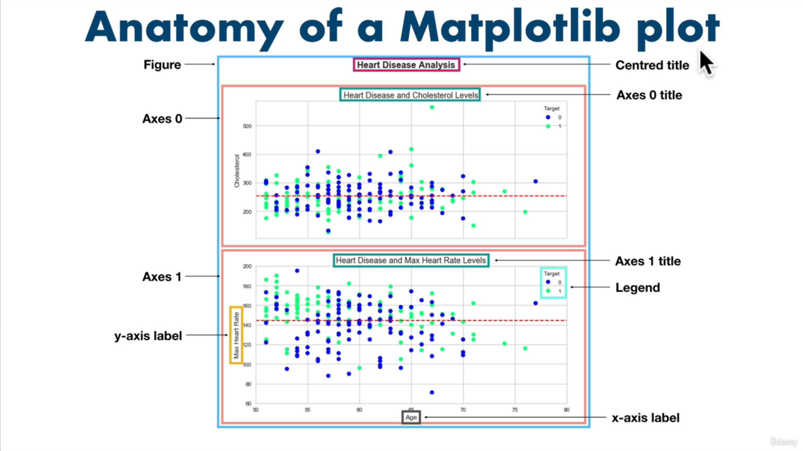

## Scikit - Learn

1. An end-to-end Scikit-Learn work workflow
2. Getting the data ready
3. Choose the right estimator/algorithm for our problems
4. Fit the model/algorithm and use it to make predictions on our data
5. Evaluating a model
6. Save and load a trained model
7. Putting it all together

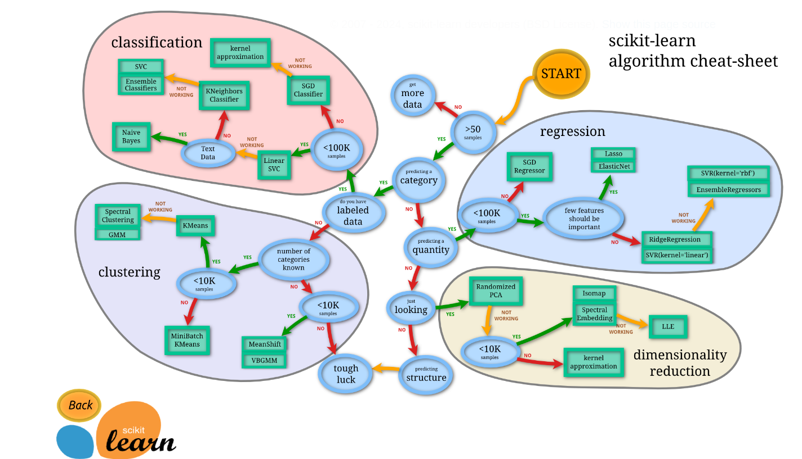

- Yapay zekâ uygulamalarında `X` ve `Y`, sıklıkla bağımsız ve bağımlı değişkenleri göstermek için kullanılır:
    - **X (Bağımsız Değişkenler):** Modelin girdi olarak kullandığı özelliklerdir. Örneğin bir ev fiyatı tahmin modelinde:
        - Oda sayısı
        - Metrekare
        - Konum
        - Yaş
    - **Y (Bağımlı Değişken):** X özelliklerinden tahmin edilmek istenen hedef değişkendir. Aynı örnekte bu, evin fiyatıdır.

### Veriyi Hazırlamak: Temizleme, Dönüştürme, Azaltma

- Veri kalitesi: hem model doğruluğunu hem de hesaplama hızını doğrudan etkiler. Tipik ön işlem adımları:
    - **Clean Data:**
        - Eksik veya boş satırları kaldırın (dropna).
        - Birimleri tutarlı hâle getirin (örneğin tüm alanları m²).
        - Kategorik renk etiketlerini sayısal kodlara çevirin (one‑hot encoding).
    - **Transform Data:**
        - Gerekirse log dönüşümü, tarih/parça ayrıştırma vb. uygulayın.
    - **Reduce Data:**
        - Sonucu etkilemeyen sütunları kaldırın (örneğin “ID” veya sabit değerli kolonlar). 
        - Özellik seçimi veya PCA ile boyut indirgeme yapın.

```
Clean Data -> Transform Data -> Reduce Data
```

### Özellik Ölçeklendirme (Feature Scaling)
- Farklı aralıklardaki özellikler, **gradyan iniş** gibi optimizasyon tabanlı algoritmalarda öğrenme hızını ve kararlılığı bozar. İki yaygın yöntem:

### Gradyan İniş Tabanlı Algoritmalar
- Linear regression, logistic regression, sinir ağları, PCA vb. modeller gradyan iniş ile parametrelerini günceller. Özellik aralıkları farklı olduğunda:
    - Büyük değerli özellikler çok küçük adımlarla güncellenir,
    - Küçük değerli özellikler çok büyük adımlarla güncellenir,
    - Sonuçta öğrenme yavaşlar veya dengesizleşir.
- Bu yüzden tüm özellikleri aynı ölçeğe getirmek, gradyan inişin minimuma hızlı ve dengeli yakınsamasını sağlar.

## Mesafeye Dayalı Algoritmalar (Distance‑Based)
- Mesafeye dayalı algoritmalar, veri noktaları arasındaki uzaklıkları kullanarak benzerlik veya kümelenme yapar. Özellik ölçekleri farklı olduğunda büyük değerli özellikler daha baskın hale gelir, bu yüzden feature scaling şarttır.
- **Örnek Algoritmalar:**
    - **K‑NN (K‑Nearest Neighbors):** Sınıflandırma ve regresyon için en yakın K komşuyu kullanır.
    - **K‑means:** Veri kümesini K kümeye ayırır, merkezine en yakın noktaları bulur.
    - **SVM (Support Vector Machines):** Sınıflandırma için hiperdüzlemler oluşturur; mesafe ölçüsüne duyarlıdır.
- **Neden Ölçeklendirme?**
    - İki özellik farklı aralıklardaysa (örneğin not ortalaması 0–5, gelir 0–100 000), gelir özelliği mesafeyi domine eder.
    - **Öklidyen mesafe** gibi metrikler, tüm özellikleri eşit katkıda bulunacak şekilde normalizasyon gerektirir.

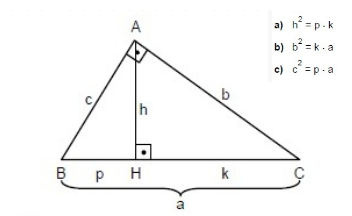

## Ağaç Tabanlı Algoritmalar (Tree‑Based)
- Ağaç tabanlı modeller, hem sınıflandırma hem de regresyon problemlerinde en popüler yöntemlerden biridir. Doğrusal olmayan ilişkileri kolayca yakalar ve özellik ölçeğine duyarsızdır.
- Karakteristik Özellikler:
    - **Split (Bölme) Kriteri:** Her düğümde, veri setini en homojen alt kümelere ayıran tek bir özelliğe göre bölme.
    - **Özellik Ölçeğine Duyarsızlık:** Tek bir özelliğe dayalı böldüğü için, diğer özelliklerin değer aralıkları bölme kararını etkilemez.
    - **Kararlılık & Yorumlanabilirlik:** Model yapısı ağaç grafiği şeklinde görselleştirilebilir.
- Örnek Algoritmalar:
    - **Decision Tree:** Tek bir ağaç yapısı kullanır.
    - **Random Forest:** Birden çok karar ağacından oluşan topluluk yöntemi.
    - **Gradient Boosted Trees:** Ardışık ağaçlarla hatayı azaltan güçlendirme yöntemi.

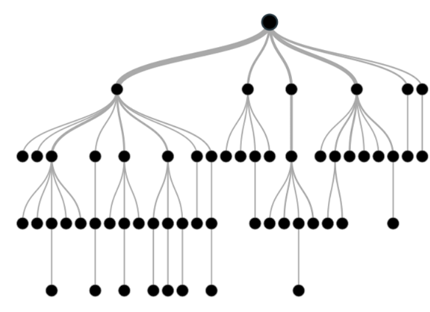

!!! note    "Not"
    Mesafeye dayalı algoritmalarda mutlaka ölçeklendirme yapın.
    Ağaç tabanlı algoritmalar ise ölçekleme gerektirmez; farklı aralıklardaki özellikleri doğrudan kullanabilir.

## Normalization (Min–Max Ölçeklendirme)
- Özellik değerlerini 0 ile 1 arasına sıkıştıran bir ölçeklendirme tekniğidir. Veri kümesindeki her değer, özellikteki en düşük ve en yüksek değerler kullanılarak yeniden hesaplanır:

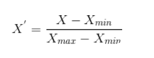

- **Avantaj:** Tüm özellikler aynı aralığa gelir, karşılaştırma kolaylaşır.
- **Dezavantaj:** Yeni gelen veride x değeri [xmin, xmax] dışında olursa duyarlılık kaybı yaşanabilir.

## Standardization (Z‑Puan Dönüşümü)
- Özelliğin ortalamasını 0’a, standart sapmasını 1’e eşitleyen bir ölçeklendirme yöntemidir:

- **μ:** Özelliğin ortalaması
- **σ:** Özelliğin standart sapması
- **Avantaj:** Aykırı değerlere karşı Min–Max’a göre daha dayanıklıdır.
- **Dezavantaj:** Dağılımın normal (Gaussian) olduğunu varsayar.

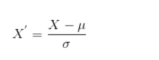

## One‑Hot Encoding
- Kategorik değişkenleri (örneğin renkler) binary sütunlara dönüştürür. Her kategori için bir sütun oluşturulur; o kategori var ise 1, yok ise 0 ile gösterilir:

| Renk	| Kırmızı	| Mavi |	Yeşil | 
|----|--------------|------|---------|
| Kırmızı	| 1 | 	0	| 0 | 
| Mavi	| 0	| 1 | 	0 | 
| Yeşil	| 0	| 0 |	1 | 

- **Avantaj:** Mesafeye dayalı algoritmalarda doğru mesafe ölçümü sağlar.
- **Dezavantaj:** Çok sayıda kategori varsa boyut patlamasına (high dimensionality) yol açabilir.

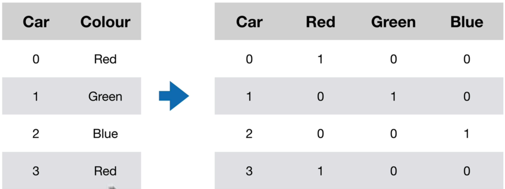

## Kavramlar

### RandomForestClassifier
- Birden çok karar ağacının (**decision tree**) ansamble edilmesiyle (**bagging**) oluşturulan, denetimli sınıflandırma algoritmasıdır.
- **Kullanım Alanı:** Sonucun kategorik olduğu (örneğin; bir kişinin hasta/sağlıklı, e-postanın spam/ham olması) problemlerde tercih edilir.
- **Özellikler:**
    - Alt örneklem (**bootstrap**) alma ve rastgele özellik seçimi ile ağaçlar arasında çeşitlilik sağlanır.
    - Aşırı öğrenme (**overfitting**) riski tek bir karar ağacına göre daha düşüktür.
- **Başlıca Parametreler:**
    - n_estimators: Ağaç sayısı (varsayılan 100).
    - max_depth: Ağaç derinliği sınırlaması.
    - max_features: Her bölünmede değerlendirilecek rastgele özellik sayısı.
- **Kütüphane:** `sklearn.ensemble.RandomForestClassifier`

### RandomForestRegressor
- RandomForestClassifier mantığının regresyon sorunlarına uyarlanmış halidir. Sürekli bir hedef değişkeni (örneğin; ev fiyatı, sıcaklık) tahmin etmek için kullanılır.
- **Kullanım Alanı:** Tahmin edilecek değerin kesikli değil de sürekli olduğu durumlar.
- Özellikler:
    - Ortalama alarak tahmin üretir (her ağacın çıktısının ortalaması).
    - Gürültüye karşı dayanıklıdır ve genellikle yüksek varyanslı modelleri dengeler.
    - Başlıca Parametreler: **RandomForestClassifier** ile benzerdir.
- Kütüphane: `sklearn.ensemble.RandomForestRegressor`

### Decision Tree (Karar Ağacı)
- Hem sınıflandırma hem de regresyon görevlerinde kullanılan, parametrik olmayan denetimli öğrenme (supervised learning) algoritmasıdır.
- Nasıl Çalışır?
    - Veri, her düğümde en iyi ayırımı sağlayan özellik ve eşik değeri (ör. Gini impurity, Entropy) seçilerek ikili dallara ayrılır.
    - Yaprak düğümlere kadar veya önceden belirlenmiş koşullara (ör. maksimum derinlik) ulaşana dek bölünme devam eder.
- **Avantajlar:**
    - Yorumlanabilir ve hızlıdır.
    - Veri ön işleme (normalizasyon, ölçekleme) genellikle gerekmez.
- **Dezavantajlar:**
    - Derin ağaçlar aşırı öğrenmeye meyillidir.
    - Karar sınırlarını dikdörtgenlere benzer bölgelere böler, dolayısıyla karmaşık sınırlar zor öğrenilir

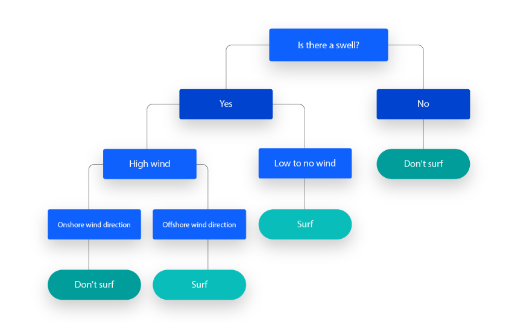

### Determination Katsayısı (R²)
- Bir regresyon modelinin verideki toplam varyansın ne kadarını açıkladığını gösteren istatistiksel ölçüdür.
- Özellikler:
    - Aralık: Teorik olarak 
    - **-∞** ile **1** arasında; pratikte modeller iyi çalıştığında `0 - 1` arası.
    - 1’e yaklaşması, modelin veriye mükemmel uyduğunu; 0’a yakın veya negatif olması ise kötü uyumu işaret eder.

!!! note "Not"

    Not: Yüksek R², modelin kesinlikle doğru olduğunu değil, sadece verideki değişimi iyi açıkladığını gösterir. Örneğin aşırı öğrenme (overfitting) durumu da yüksek R² ile maskelenebilir.

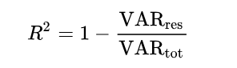

### ROC Eğrisi (Receiver Operating Characteristic Curve)
- İkili sınıflandırmada farklı karar eşiklerinin (**threshold**) performansını, **Gerçek Pozitif Oranı (TPR)** ve **Yanlış Pozitif Oranı (FPR)** eksenine karşı çizerek gösteren grafiktir.

- **Kullanım:**
    - **Eşik değeri seçimi:** Eğriye en yakın nokta, en iyi dengeyi sağlar.
    - **İki modelin karşılaştırılması:** Eğrisi üstte kalan model daha iyi ayırt edici güce sahiptir.

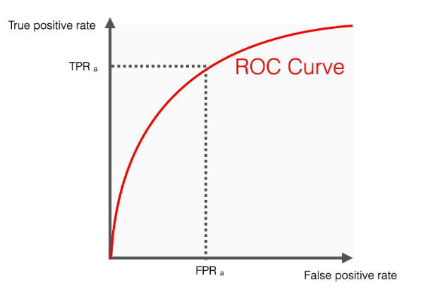

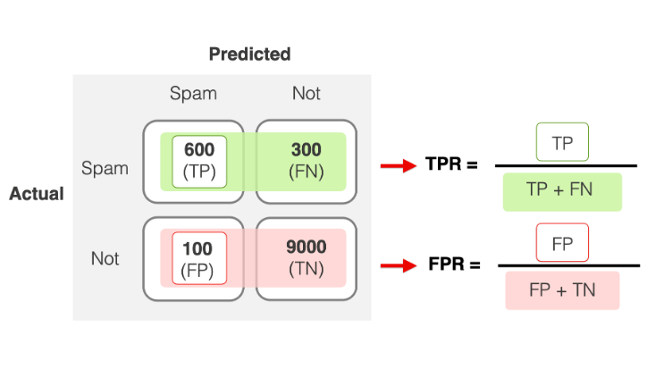


!!! note "Bilgi"
    [Josh Starmer’dan açık anlatım](https://www.youtube.com/watch?v=4jRBRDbJemM&ab_channel=StatQuestwithJoshStarmer)

### ROC AUC Skoru
- ROC eğrisinin altındaki alanın (`Area Under Curve`) sayısal değeridir.
- **Özellikler:**
    - Aralık: 0.0–1.0
        - 0.5: Rastgele tahmin (şans)
        - 1.0: Mükemmel ayırt edici güç
    - Modelin tüm eşiklerdeki ayırt edici performansını özetler.
- **Yorum:**
    - 0.7–0.8: İyi
    - 0.8–0.9: Çok iyi
    - 0.9: Mükemmel

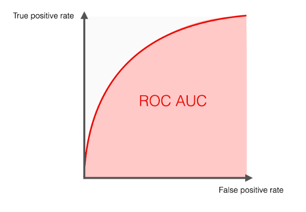


!!! note "İpuçları ve Ek Bilgiler"
    - **Model Değerlendirme:** Sadece tek bir metriğe (ör. R²’ye) bağlı kalmayın; MSE, MAE, Precision, Recall, F1-score gibi ek metrikleri de inceleyin.
    - **Görselleştirme:** Karar ağacını sklearn.tree.export_graphviz veya plot_tree ile görselleştirin, böylece karar kurallarını somut olarak görebilirsiniz.
    - **Hiperparametre Ayarı:** GridSearchCV veya RandomizedSearchCV kullanarak `n_estimators`, `max_depth`, `min_samples_split` gibi parametreleri optimize edin.
    - **Genel Bakış:** Ensemble yöntemler (Random Forest, Gradient Boosting) tek ağaçlara kıyasla genellikle daha kararlı ve yüksek performanslı sonuçlar verir. Cesaretli olun, hatalı sonuçlardan ders çıkarın ve modelinizi sürekli iyileştirmeye odaklanın! 